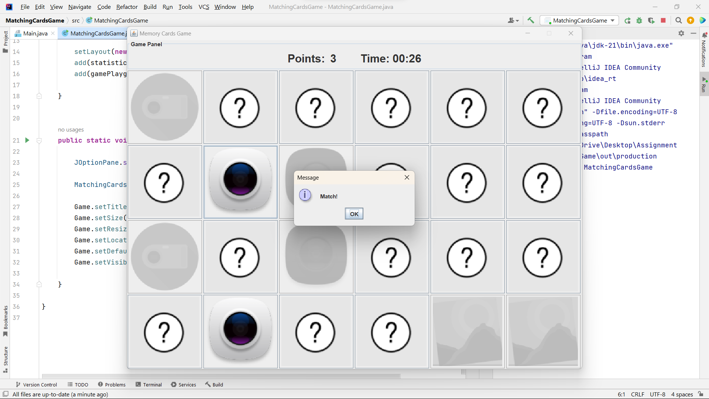

# 🃏 Matching Cards Game

A Java Swing-based Memory Matching Game where players flip cards to find matching pairs before time runs out.

---

## 📌 Overview

Matching Cards Game is a desktop GUI application built using **Java Swing**.

### Game Rules:
- ⏳ You get **5 seconds** to memorize the cards at the start.
- ⏰ You have **60 seconds** total to match all pairs.
- 🎯 Each correct match increases your score.
- ❌ If time runs out, the game ends.

---

## 🎮 Gameplay Flow

1. All cards are shown face-up for **5 seconds**.
2. Cards automatically flip face-down.
3. Player clicks two cards:
   - ✅ If they match → They stay revealed & score increases.
   - ❌ If they don’t match → They flip back.
4. Game ends when:
   - Time reaches zero, or
   - All pairs are matched.

---

## 🛠 Technologies Used

- Java
- Java Swing
- AWT Event Handling
- `javax.swing.Timer`
- GridLayout

---

## 📂 Project Structure
```
MatchingCardsGame/
│
├── src/
│ ├── MatchingCardsGame.java
│ ├── game.java
│ ├── card.java
│ ├── CardClickListener.java
│ └── pane.java
│
├── Images/
│ ├── (24 card images)
│ └── unknown.png
│
├── matched.png
├── unmatched.png
├── LICENSE
├── .gitignore
└── README.md
```


---

## 🖼 Images Directory

The `Images/` folder contains:

- **24 card images**
- The developer selects **12 unique images** to create matching pairs (total 24 cards).
- `unknown.png` is used as the back of the card.

> ⚠️ Image file names must match the names used inside the code.

---

## 🧠 Core Components

### 🔹 `MatchingCardsGame`
- Main application window (`JFrame`)
- Combines:
  - Score & timer panel (top)
  - Game board grid (center)

---

### 🔹 `game`
- Extends `JPanel`
- Creates and shuffles 24 cards
- Handles:
  - Card grid layout (4x6)
  - Score tracking
  - First & second card selection

---

### 🔹 `card`
- Extends `JButton`
- Manages:
  - Card flipping
  - Match checking
  - Image updates

---

### 🔹 `CardClickListener`
Controls card click behavior:
- Stores first click
- Compares with second click
- Resets selection

---

### 🔹 `pane`
Displays:
- 🎯 Current score
- ⏳ Countdown timer (60 seconds)

Ends the game when time reaches zero.

---

## ▶️ How to Run the Project

### 1️⃣ Requirements
- Java JDK 8 or higher

### 2️⃣ Compile

From the project root:

```bash
cd src
javac *.java
```

### 3️⃣ Run

```bash
java MatchingCardsGame
```
---


## 📸 Screenshots

### ✅ Match Example


### ❌ Unmatched Example


---


## 🎯 Features
- 4x6 grid layout
- Randomized card positions
- Score tracking
- Countdown time
- Match / No Match dialog messages
- Game Over popup
- Simple and clean UI

---

## 🚀 Possible Improvements

- Add restart button
- Add difficulty levels (Easy / Medium / Hard)
- Improve UI design
- Add sound effects
- Refactor card creation using loops
- Remove static fields for better architecture
- Add win condition screen

---

## 👨‍💻 Author
Developed by Ayman Soliman

GitHub: 

---

## 📜 License

This project is licensed under the terms described in the LICENSE file.
